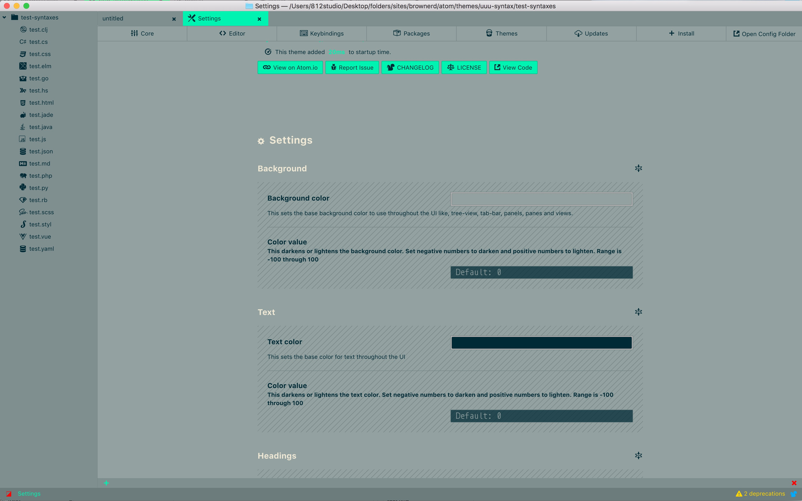
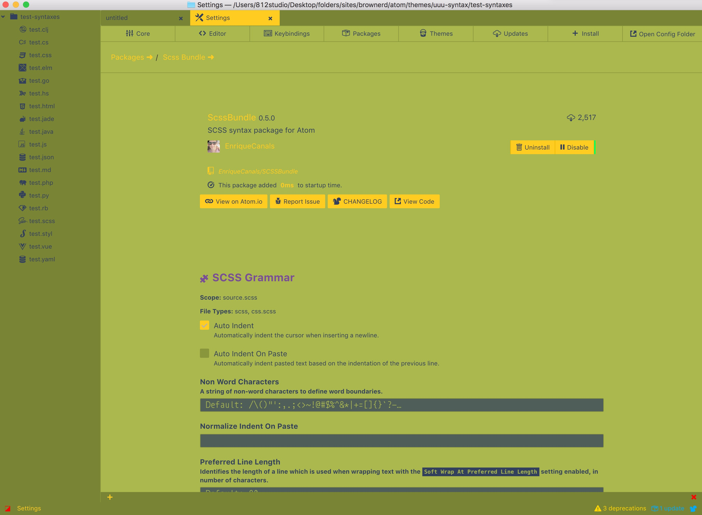
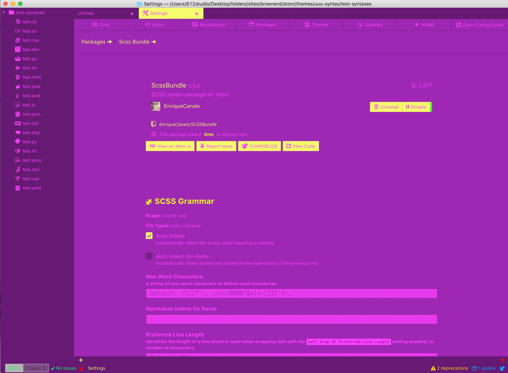
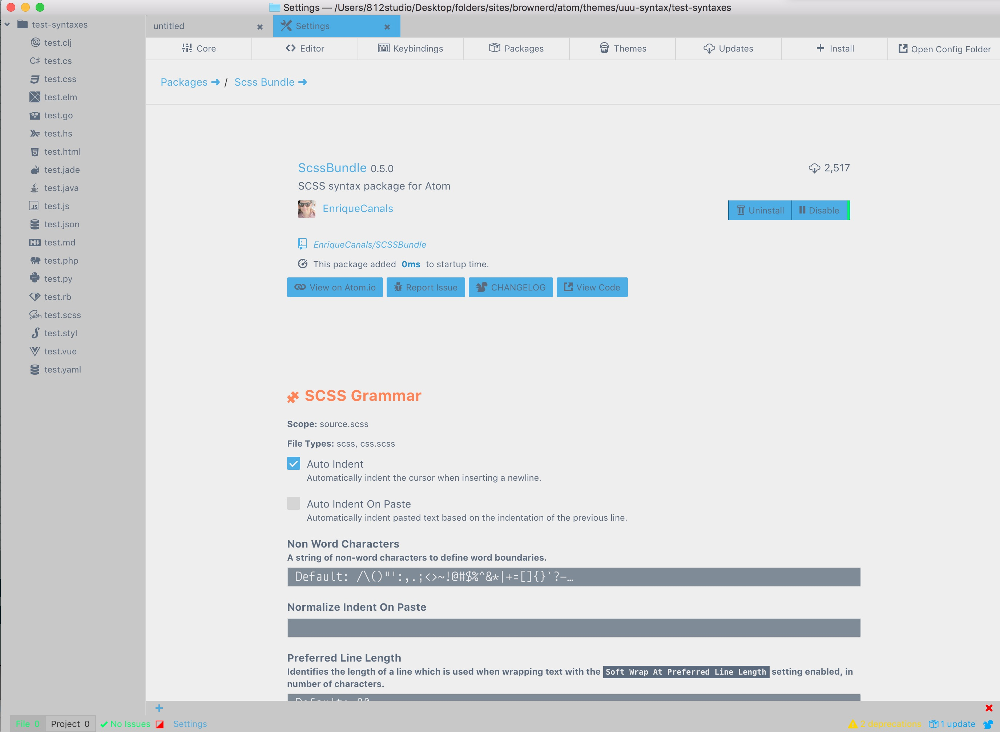
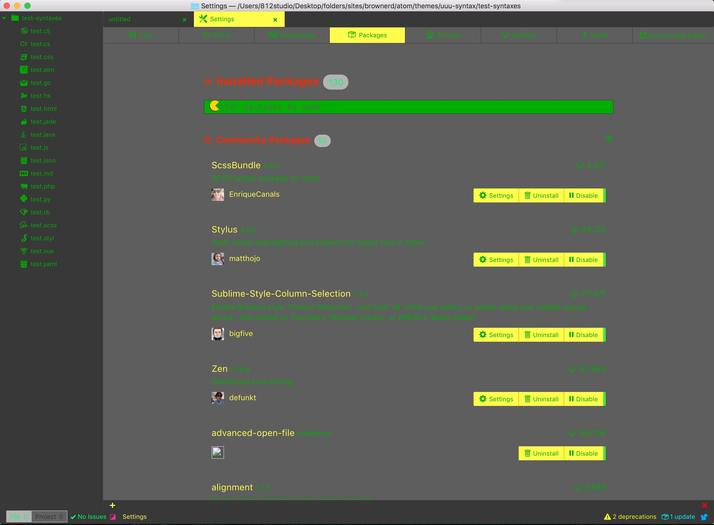
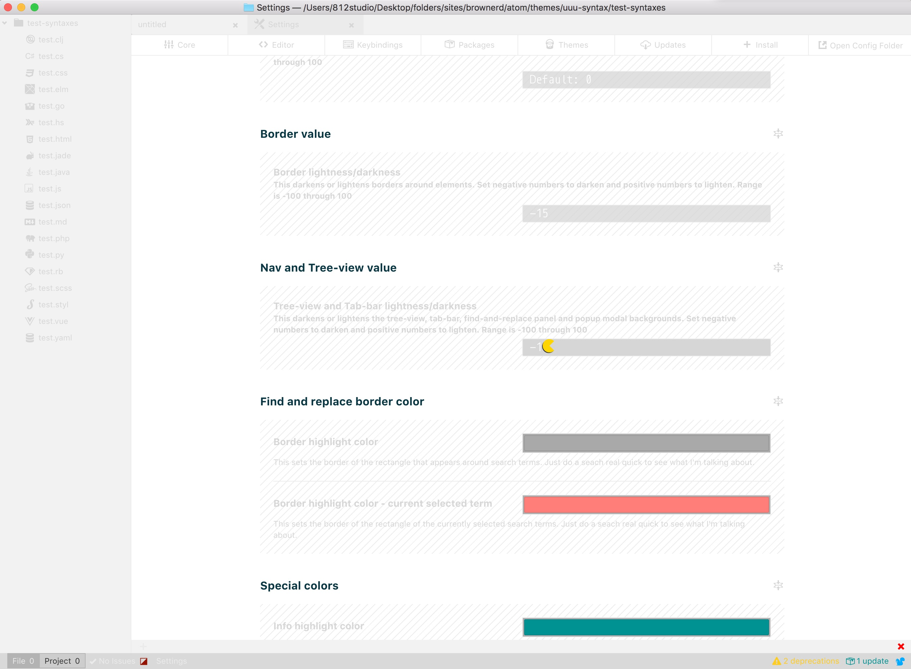
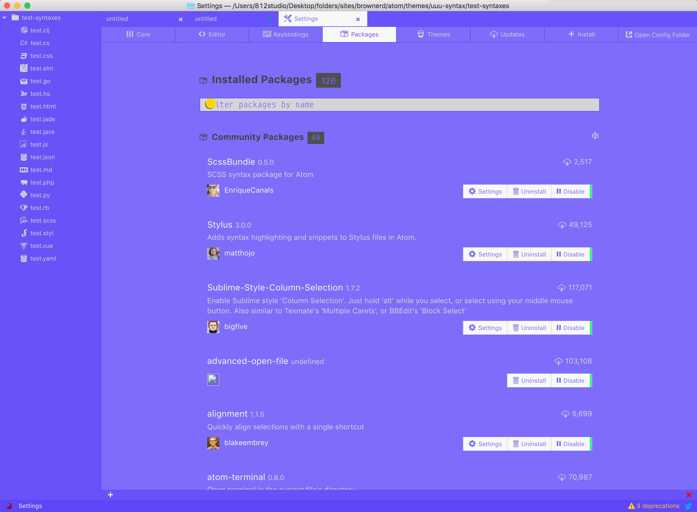
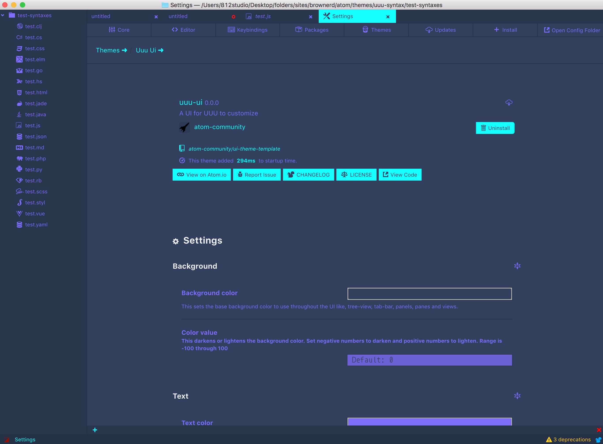
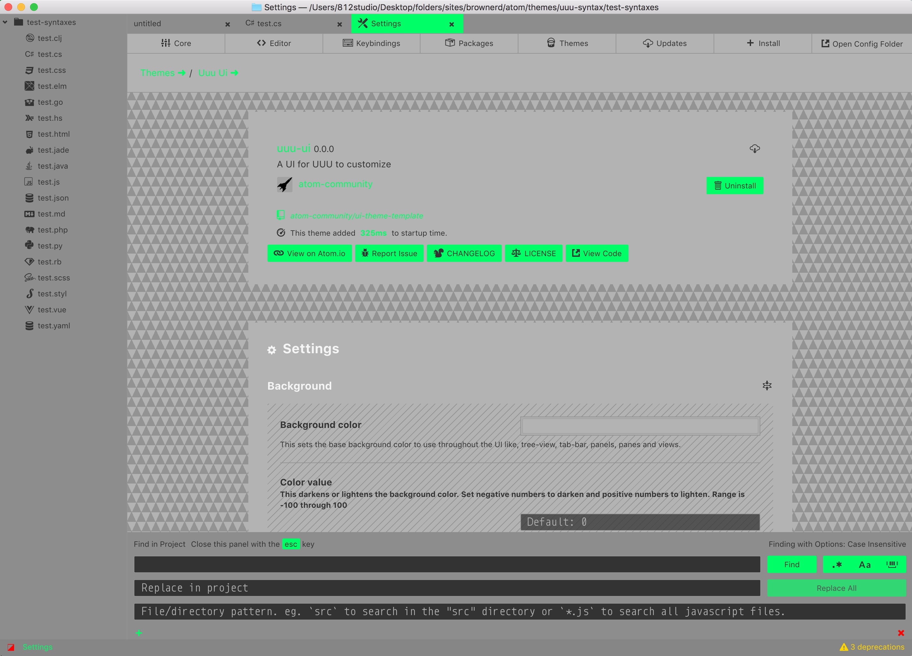

# UUU

Use this package for exporting and importing UUUr syntax and UI themes created with UUU-Syntax and UUU-UI. This is SUPER easy to do.


## Video - UUU


## Video - UUU-Syntax


## Video - UUU-UI

- Adjust bg
- adjust bg value

- adjust text color and value


## Collections


### Teams

#### STL Cardinals - UI

```

```


### Popularish

#### Material Dark Snake - UI

```less
@text-color: rgba(131, 148, 150, 1);
@value-text-color: 0;
@heading-color: rgba(230, 186, 82, 1);
@value-heading-color: 0;
@background-color: rgba(36, 47, 52, 1);
@value-background-color: 0;
@button-color: rgba(191, 54, 54, 1);
@value-button-color: 0;
@value-border-color: -5;
@nav-value: 0;
@find-and-replace-border-highlight-color: rgba(255, 255, 255, 1);
@find-and-replace-current-border-highlight-color: rgba(0, 255, 102, 1);
@info-color: rgba(0, 170, 255, 1);
@success-color: rgba(0, 255, 102, 1);
@warning-color: rgba(255, 213, 0, 1);
@error-color: rgba(255, 0, 0, 1);
@settings-bg-style: triangle;
@settings-nav: horizontal;
@settings-border: false;
```


#### Jabari - UI



```less
@text-color: rgba(0, 43, 54, 1);
@text-value: 0;
@heading-color: rgba(238, 232, 213, 1);
@heading-value: 0;
@background-color: rgba(147, 161, 161, 1);
@background-value: 0;
@button-color: rgba(0, 243, 178, 1);
@button-value: 0;
@border-value: -20;
@nav-value: -15;
@findAndReplace-borderHighLightColor: rgba(255, 255, 255, 1);
@findAndReplace-borderHighLightColorCurrent: rgba(220, 50, 47, 1);
@git-infoColor: rgba(0, 170, 255, 1);
@git-successColor: rgba(0, 255, 102, 1);
@git-warningColor: rgba(255, 213, 0, 1);
@git-errorColor: rgba(255, 0, 0, 1);
@settingsPage-background: solid;
@settingsPage-nav: horizontal;
@settingsPage-border: false;
```


#### Ninja Turtle UI (Fun)



```less
@text-color: rgba(50, 64, 94, 1);
@text-value: 0;
@heading-color: rgba(122, 77, 154, 1);
@heading-value: 0;
@background-color: rgba(170, 184, 77, 1);
@background-value: 0;
@button-color: rgba(255, 204, 33, 1);
@button-value: 0;
@border-value: -20;
@nav-value: -30;
@findAndReplace-borderHighLightColor: rgba(255, 255, 255, 1);
@findAndReplace-borderHighLightColorCurrent: rgba(220, 50, 47, 1);
@git-infoColor: rgba(0, 170, 255, 1);
@git-successColor: rgba(0, 255, 102, 1);
@git-warningColor: rgba(255, 213, 0, 1);
@git-errorColor: rgba(255, 0, 0, 1);
@settingsPage-background: solid;
@settingsPage-nav: horizontal;
@settingsPage-border: false;
```


#### Miami Vice (Fun)



```less
@text-color: rgba(255, 47, 146, 1);
@text-value: 0;
@heading-color: rgba(239, 251, 34, 1);
@heading-value: 0;
@background-color: rgba(158, 40, 179, 1);
@background-value: 0;
@button-color: rgba(239, 251, 34, 1);
@button-value: 30;
@border-value: -20;
@nav-value: -30;
@findAndReplace-borderHighLightColor: rgba(255, 255, 255, 1);
@findAndReplace-borderHighLightColorCurrent: rgba(254, 131, 87, 1);
@git-infoColor: rgba(0, 249, 249, 1);
@git-successColor: rgba(0, 255, 102, 1);
@git-warningColor: rgba(239, 251, 34, 1);
@git-errorColor: rgba(255, 47, 146, 1);
@settingsPage-background: solid;
@settingsPage-nav: horizontal;
@settingsPage-border: false;
```


#### Airline UI (Light)



```less
@text-color: rgba(91, 106, 124, 1);
@text-value: 0;
@heading-color: rgba(254, 131, 87, 1);
@heading-value: 0;
@background-color: rgba(238, 238, 238, 1);
@background-value: 0;
@button-color: rgba(29, 138, 200, 1);
@button-value: 30;
@border-value: -20;
@nav-value: -30;
@findAndReplace-borderHighLightColor: rgba(255, 255, 255, 1);
@findAndReplace-borderHighLightColorCurrent: rgba(254, 131, 87, 1);
@git-infoColor: rgba(0, 170, 255, 1);
@git-successColor: rgba(0, 255, 102, 1);
@git-warningColor: rgba(255, 213, 0, 1);
@git-errorColor: rgba(255, 0, 0, 1);
@settingsPage-background: solid;
@settingsPage-nav: horizontal;
@settingsPage-border: false;
```


#### Marley UI (Fun)



```less
@text-color: rgba(0, 249, 0, 1);
@text-value: -30;
@heading-color: rgba(255, 38, 0, 1);
@heading-value: 0;
@background-color: rgba(0, 0, 0, 1);
@background-value: 0;
@button-color: rgba(255, 251, 0, 1);
@button-value: 30;
@border-value: 30;
@nav-value: -30;
@findAndReplace-borderHighLightColor: rgba(255, 255, 255, 1);
@findAndReplace-borderHighLightColorCurrent: rgba(255, 38, 0, 1);
@git-infoColor: rgba(0, 145, 147, 1);
@git-successColor: rgba(79, 143, 0, 1);
@git-warningColor: rgba(255, 204, 33, 1);
@git-errorColor: rgba(148, 17, 0, 1);
@settingsPage-background: solid;
@settingsPage-nav: horizontal;
@settingsPage-border: false;
```


#### Whiteout (Light)



```less
@text-color: rgba(214, 214, 214, 1);
@text-value: 0;
@heading-color: rgba(7, 54, 66, 1);
@heading-value: 0;
@background-color: rgba(255, 255, 255, 1);
@background-value: 0;
@button-color: rgba(235, 235, 235, 1);
@button-value: 0;
@border-value: -15;
@nav-value: -10;
@findAndReplace-borderHighLightColor: rgba(169, 169, 169, 1);
@findAndReplace-borderHighLightColorCurrent: rgba(255, 126, 121, 1);
@git-infoColor: rgba(0, 145, 147, 1);
@git-successColor: rgba(79, 143, 0, 1);
@git-warningColor: rgba(255, 204, 33, 1);
@git-errorColor: rgba(148, 17, 0, 1);
@settingsPage-background: solid;
@settingsPage-nav: horizontal;
@settingsPage-border: false;
```

#### Miles (Blue)



```less
@text-color: rgba(238, 238, 238, 1);
@text-value: -20;
@heading-color: rgba(66, 66, 66, 1);
@heading-value: 0;
@background-color: rgba(126, 108, 250, 1);
@background-value: 0;
@button-color: rgba(235, 235, 235, 1);
@button-value: 10;
@border-value: -15;
@nav-value: -10;
@findAndReplace-borderHighLightColor: rgba(169, 169, 169, 1);
@findAndReplace-borderHighLightColorCurrent: rgba(255, 126, 121, 1);
@git-infoColor: rgba(0, 145, 147, 1);
@git-successColor: rgba(79, 143, 0, 1);
@git-warningColor: rgba(255, 204, 33, 1);
@git-errorColor: rgba(148, 17, 0, 1);
@settingsPage-background: solid;
@settingsPage-nav: horizontal;
@settingsPage-border: false;
```


#### Materialish



```less

```


#### URAWSM



```less
@text-color: rgba(51, 51, 51, 1);
@text-value: 0;
@heading-color: rgba(245, 245, 245, 1);
@heading-value: 0;
@background-color: rgba(179, 179, 179, 1);
@background-value: 0;
@button-color: rgba(0, 255, 102, 1);
@button-value: 0;
@button-textcolor: text;
@border-value: -25;
@border-radius: 2;
@nav-value: -30;
@findAndReplace-borderHighLightColor: rgba(255, 255, 255, 1);
@findAndReplace-borderHighLightColorCurrent: rgba(0, 255, 102, 1);
@git-infoColor: rgba(0, 170, 255, 1);
@git-successColor: rgba(0, 255, 102, 1);
@git-warningColor: rgba(255, 213, 0, 1);
@git-errorColor: rgba(255, 0, 0, 1);
@settingsPage-background: triangle;
@settingsPage-nav: horizontal;
@settingsPage-border: false;
```
