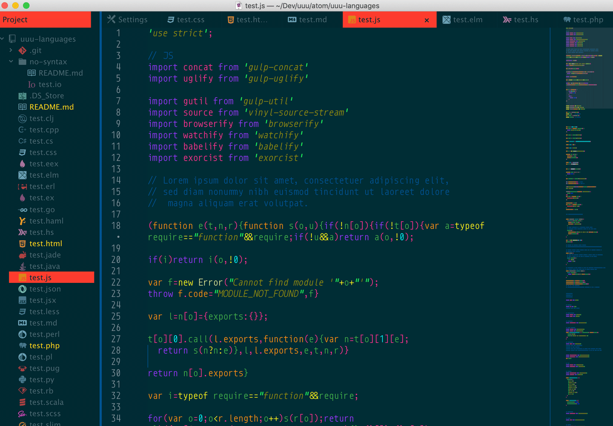
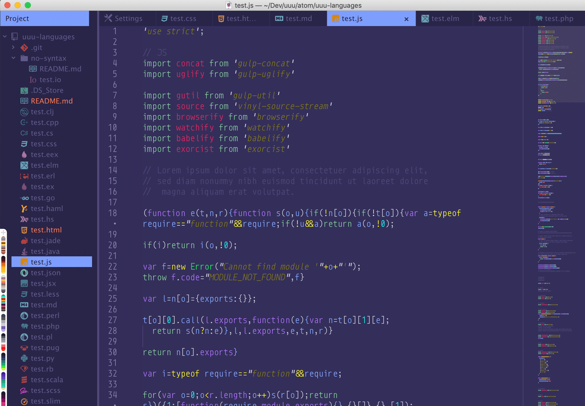
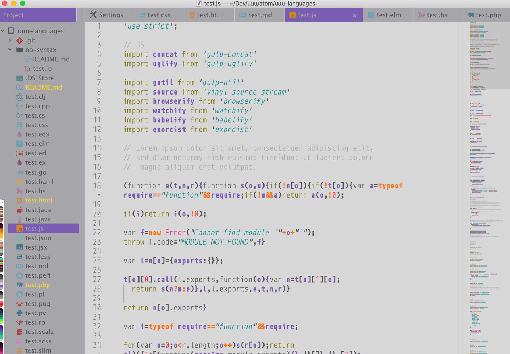
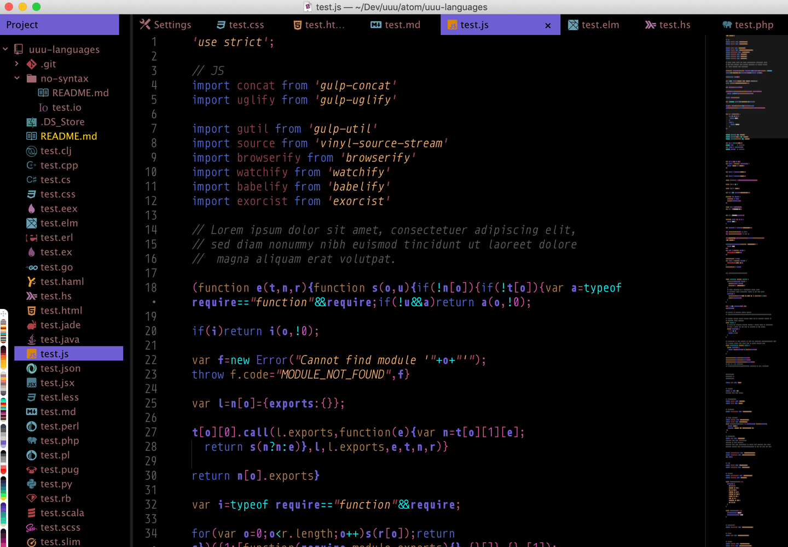
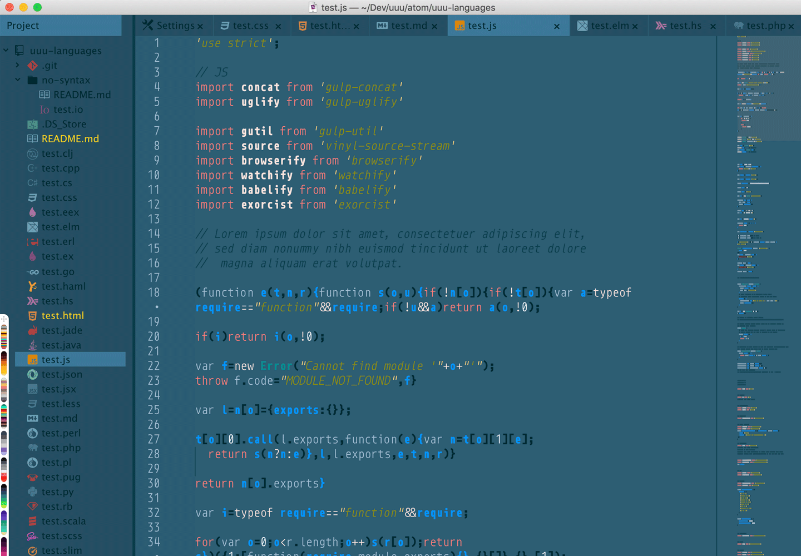

# UUU KIT

Enable Importing, Exporting and Saving of UUU syntax and ui themes easily.

## Video overview
Just watch this overview [video](https://youtu.be/C2N2O3WR-3U)

## Documentation
Visit the [UUU](https://uuu.works/docs/) site for more info and documentation.

## Installation/Dependencies
- UUU-UI
- UUU-SYNTAX
- UUU-kit

Run the line below in your terminal to  install all dependencies
`apm install uuu-ui uuu-syntax uuu-kit`

## Usage
This package does several things:

1. Imports and Exports UI and SYNTAX made with UUU
1. Syncs font-sizes between UI and SYNTAX
1. Enables you to switch between preset UUU themes
1. Enables you to save and switch between your own themes
1. Makes it easy to Reload the window

## Make themes quickly

Here are a few examples:

### Schmaterial

### Melowdrama

### SuperNES

### Avengers Endgame

### Game of Thrones - Ice King of the Whitewalkers

